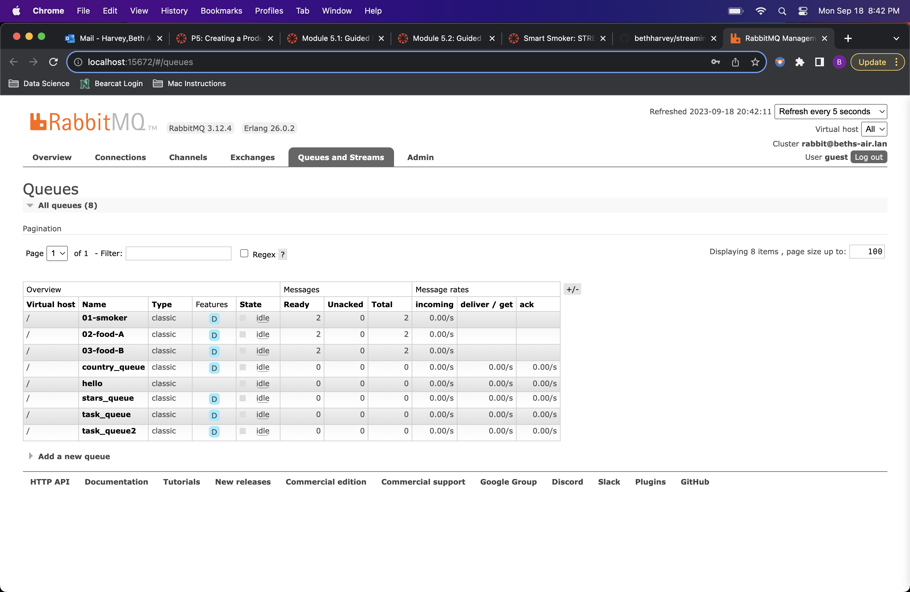
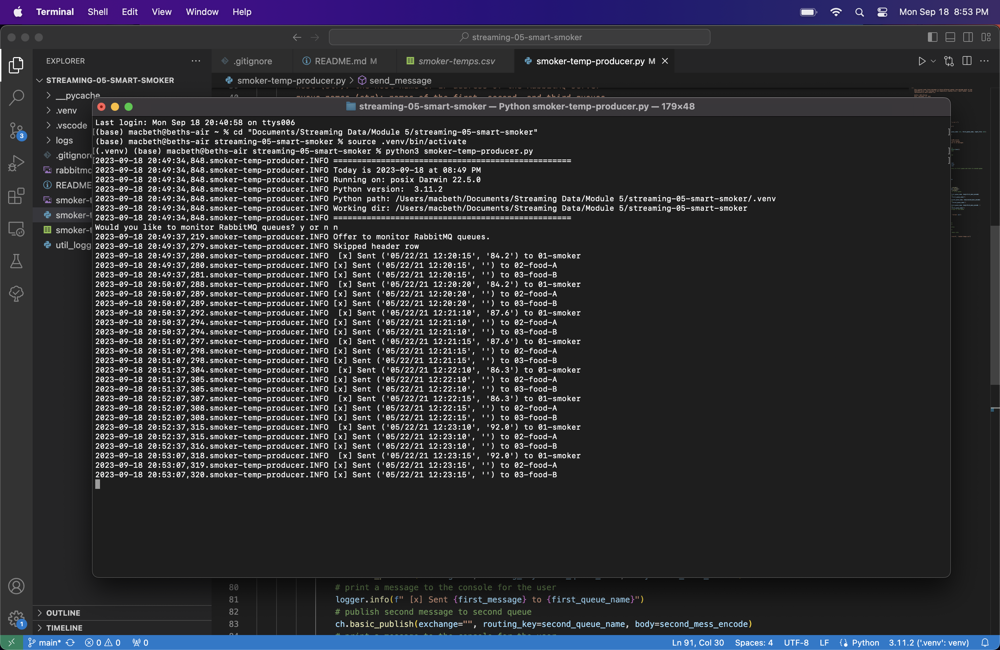

# streaming-05-smart-smoker

* Beth Harvey
* Streaming Data
* Module 5
* September 13, 2023

## Project Overview

The goal of this project is to create a producer to send messages representing three temperature readings from a smart smoker. Channel 1 is the temperature of the smoker itself, Channel 2 is the temperature of one food (Food A), and Channel 3 is the temperature of a second food (Food B). Each temperature is sent to a different consumer through a dedicated queue using RabbitMQ.

## Data Source

The temperature measurements for this project are individual rows from the [smoker-temps](smoker-temps.csv) file in this repository.

## Requirements

1. Git
2. Python 3.7+ (3.11+ preferred)
3. VS Code Editor
4. VS Code Extension: Python (by Microsoft)
5. RabbitMQ Server installed and running locally
6. Virtual Environment
    * `python3 -m venv .venv`
    * `source .venv/bin/activate`
7. Pika
    * `python3 -m pip install pika`

## Running the Code

In a terminal window, navigate to the folder containing this repo, create and activate a virtual environment, and install Pika (see above). Run the producer file by entering:
    `python3 smoker-temp-producer.py`
Enter "y" to open the RabbitMQ queue monitor (enter "guest" as the username and password) or "n" to skip that step. The script will stream messages from one row of data every 3 seconds, and a confirmation message will be displayed in the terminal for each message. The stream will end when the entire file has been streamed or upon user interruption using CTRL+C.

The queue is deleted and redeclared when the script is started.

## Screenshots

See examples of the RabbitMQ queue monitor page and the producer script below.

