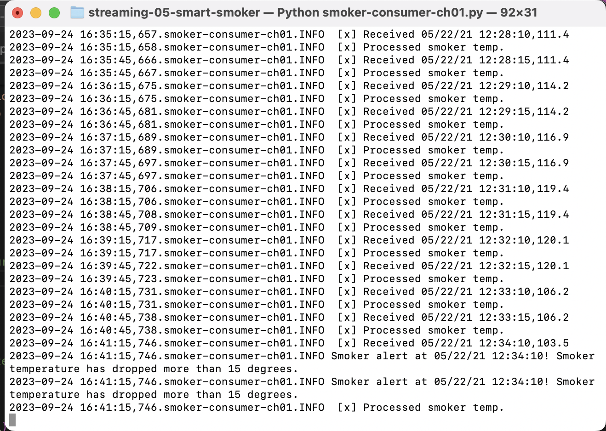

# streaming-05-smart-smoker

* Beth Harvey
* Streaming Data
* Modules 5 and 6
* September 18, 2023

## Project Overview

The goal of this project is to create a producer and three consumers to send and receive messages representing three temperature readings from a smart smoker. Channel 1 is the temperature of the smoker itself, Channel 2 is the temperature of one food (Food A), and Channel 3 is the temperature of a second food (Food B). Each temperature is sent to a different consumer through a dedicated queue using RabbitMQ.

The consumers receive messages from the appropriate queue, add them to a deque, and monitor for temperature issues. An alert is displayed if the temperature of the smoker drops more than 15 degrees within 2.5 minutes or if the temperature of Food A or Food B does not change more than 1 degree within 10 minutes. Email alerts can also be sent for these events.

## Data Source

The temperature measurements for this project are individual rows from the [smoker-temps](smoker-temps.csv) file in this repository.

## Requirements

1. Git
2. Python 3.7+ (3.11+ preferred)
3. VS Code Editor
4. VS Code Extension: Python (by Microsoft)
5. RabbitMQ Server installed and running locally
6. Virtual Environment
    * `python3 -m venv .venv`
    * `source .venv/bin/activate`
7. Pika
    * `python3 -m pip install pika`

## Files
* smoker-temps.csv: Contains the data points used in this project
* smoker-temp-producer.py: Processes rows from smoker-temps.csv and sends them to the corresponding queues
* smoker-consumer-ch01, 02, 03: Receive messages from the appropriate queues and monitor for alert events
* email-alerts.py: Creates and sends email alerts for temperature alerts for each queue.
* .env-example.toml: An example file for configuring email login information for email alerts.

## Running the Code

In a terminal window, navigate to the folder containing this repo, create and activate a virtual environment, and install Pika (see above). Run the producer file by entering:

    `python3 smoker-temp-producer.py`

Enter "y" to open the RabbitMQ queue monitor (enter "guest" as the username and password) or "n" to skip that step. The script will stream messages from one row of data every 30 seconds, and a confirmation message will be displayed in the terminal for each message. The stream will end when the entire file has been streamed or upon user interruption using CTRL+C.

The queue is deleted and redeclared when the script is started.

The process for running the consumers is very similar to the producer. Navigate to the proper directory, activate the virtual environment, and enter:

    `python3 [name of consumer file]`

Note that the producer should be started before the consumers, since the producer deletes the queues on startup.

## Email Alerts

To send email alerts for the various temperature alerts, use .env-example.toml as a template to enter the desired email address and password. Add this file to your .gitignore to make sure it is not shared. Note: For a Gmail address, an app password should be used in place of the account password. Instructions for setting up an app password can be found here: https://support.google.com/accounts/answer/185833?hl=en

To deactivate email alerts, remove or comment out the "createAndSendEmailAlert()" function call in each of the consumer callback functions.

## Screenshots

See examples of the RabbitMQ queue monitor page, the running scripts, and the terminal and email alerts.

#### RabbitMQ Monitor Page

#### Smoker Temperature Producer Script Running

#### Producer with Three Consumers Running

#### Smoker Alert

#### Food A Alert

#### Food B Alert

#### Smoker Email Alert Example
